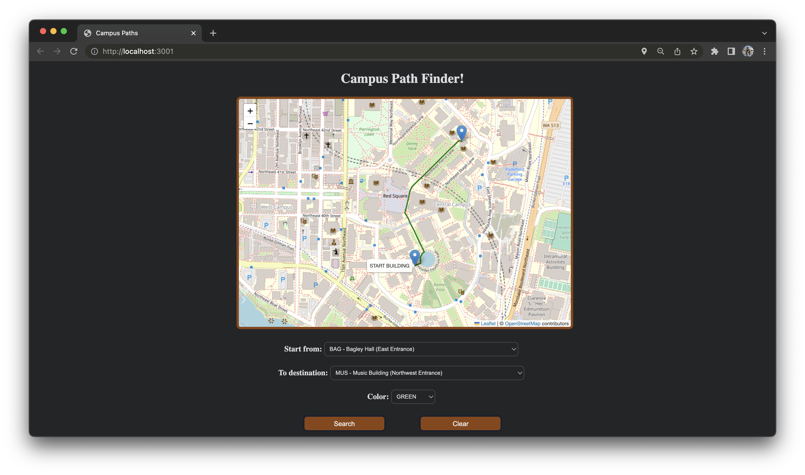

# Path Finder 🗺️

[![LinkedIn][linkedin-shield]][linkedin-url]
[![Personal][personal-shield]][personal-url]


<!-- PROJECT LOGO -->
<br />
<div align="center">
  <a href="https://github.com/leahjia/Projects">
    
  </a>

  <h3 align="center">Campus Path Finder</h3>

  <p align="center">
    The quickest way to find available routes on campus!
  </p>
</div>

<!-- ABOUT THE PROJECT -->
## About The Project
* Path Finder is a client-server application to allow you to search for the shortest routes on UW campus 🏫
* It uses the modeling of map data structure and API endpoints to allow frontend connection to backend 💻
* It increases data sorting and retrieval speed by 70% by incorporating Dijkstra’s algorithm ✔️
* It also ensures high complexity and functionality of the application with Jest, JUnit, and script tests that runs in the back end 🥇


### Built With

[![Java][Java-shield]][Java-url]
[![Typescript][ts-shield]][ts-url]
[![React][React.js]][React-url]
[![HTML5][HTML5-shield]][HTML5-url]
[![CSS][CSS3-shield]][CSS3-url]
[![Bootstrap][Bootstrap.com]][Bootstrap-url]

### Prerequisites
* Spark
  ```sh
  cd campuspaths-server
  gradle runSpark
  ```
* npm
  ```sh
  npm install
  npm start
  ```

#### Potential Issue Fix
  ```sh
  export NODE_OPTIONS=--openssl-legacy-provider
  ```

<!-- CONTACT -->
## Contact / Feedback

Email: yuwenj3@uw.edu

Personal Web - [leahjia.com](https://leahjia.com/)

LinkedIn - [@leahjia](https://www.linkedin.com/in/leahjia/)


<!-- ACKNOWLEDGMENTS -->
## Acknowledgments
* [Img Shields](https://shields.io)
* [GitHub Pages](https://pages.github.com)
* [React Icons](https://react-icons.github.io/react-icons/search)

<p align="right">(<a href="#readme-top">back to top</a>)</p>


<!-- MARKDOWN LINKS & IMAGES -->
<!-- https://www.markdownguide.org/basic-syntax/#reference-style-links -->
[linkedin-shield]: https://img.shields.io/badge/-LinkedIn-black.svg?style=for-the-badge&logo=linkedin&colorB=555
[linkedin-url]: https://linkedin.com/in/leahjia/
[personal-shield]: https://img.shields.io/badge/Leah-Jia-blue?style=for-the-badge
[personal-url]: https://leahjia.com/
[Java-shield]: https://img.shields.io/badge/Java-ED8B00?style=for-the-badge&logo=java&logoColor=white
[Java-url]: https://dev.java/
[ts-shield]: https://shields.io/badge/TypeScript-3178C6?logo=TypeScript&logoColor=FFF&style=for-the-badge
[ts-url]: https://www.typescriptlang.org/
[React.js]: https://img.shields.io/badge/React-20232A?style=for-the-badge&logo=react&logoColor=61DAFB
[React-url]: https://reactjs.org/
[HTML5-shield]: https://img.shields.io/badge/html5%20-%23E34F26.svg?&style=for-the-badge&logo=html5&logoColor=white
[HTML5-url]: https://html.com/
[CSS3-shield]: https://img.shields.io/badge/css3%20-%231572B6.svg?&style=for-the-badge&logo=css3&logoColor=white
[CSS3-url]: https://developer.mozilla.org/en-US/docs/Web/CSS
[Bootstrap.com]: https://img.shields.io/badge/Bootstrap-563D7C?style=for-the-badge&logo=bootstrap&logoColor=white
[Bootstrap-url]: https://getbootstrap.com
